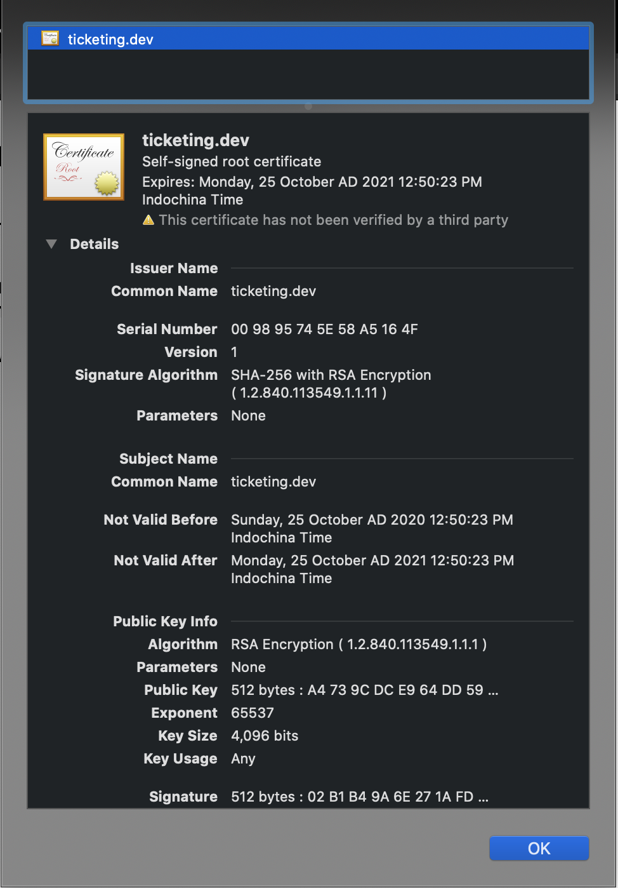
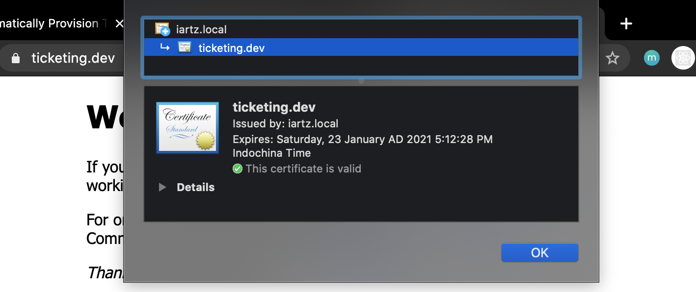

# Create a Kubernetes TLS Ingress from scratch

## Manual TLS Ingress

- [x] Create Deployment

    ```shell
    k create depoly --image=nginx-depl
    ```

- [x] Create ingress

    ```yaml
    apiVersion: extensions/v1beta1
    kind: Ingress
    metadata:
      name: nginx
    spec:
      rules:
        - host: ticketing.dev
          http:
            paths:
              - backend:
                  serviceName: nginx-dpl
                  servicePort: 80
    ```

- [x] Generate certificate

    ```shell
    openssl req -x509 -newkey rsa:4096 -sha256 -nodes -keyout tls.key -out tls.crt -subj "/CN=ticketing.dev" -days 365
    ```

- [x] Create secret tls

    ```shell
    k create secret tls ticketing-dev-tls --cert=tls.crt --key=tls.key
    ```

- [x] Modify ingress.yaml

    ```yaml
    apiVersion: extensions/v1beta1
    kind: Ingress
    metadata:
      name: nginx
    spec:
      tls:
        - secretName: ticketing-dev-tls
          hosts:
            - ticketing.dev
      rules:
        - host: ticketing.dev
          http:
            paths:
              - backend:
                  serviceName: nginx-dpl
                  servicePort: 80
    ```

- [x] Apply deployment ingress.yaml
- [x] curl -k <https://ticketing.dev>
- [x] curl --cacert tls.crt <https://ticketing.dev>
- 

## Automatically Provision TLS Certificate in K8s with cert-manager

- [x] Install cert-manager

    ```shell
    k apply --validate=false -f https://github.com/jetstack/cert-manager/releases/download/v1.0.3/cert-manager.yaml
    ```

- [x] Verify install

    ```shell
    k get crd
    ```

- [x] Create new key

    ```shell
    openssl genrsa -out ca.key 2048
    ```

- [x] Copy openssl.cnf

    ```shell
    cp /etc/ssl/openssl.cnf openssl-with-ca.cnf
    ```

- [x] Modify openssl-with-ca.cnf(Issuse for macOS)

    ```conf
    [ v3_ca ]
    basicConstraints = critical,CA:TRUE
    subjectKeyIdentifier = hash
    authorityKeyIdentifier = keyid:always,issuer:always
    ```

- [x] Sign certificate root CA

    ```shell
    openssl req -x509 -new -nodes -key ca.key -sha256 -subj "/CN=iartz.local" -days 1024 -out ca.crt -extensions v3_ca -config openssl-with-ca.cnf
    ```

- [x] Create secret tls ca-key-pair

    ```shell
    k create secret tls ca-key-pair --key=ca.key --cert=ca.crt
    ```

- [x] Create Issier yaml

    ```shell
    apiVersion: cert-manager.io/v1
    kind: Issuer
    metadata:
      name: ca-issuer
      namespace: default
    spec:
      ca:
        secretName: ca-key-pair
    ```

- [x] Apply issuer.yaml
- [x] Verify Issuer
- [x] Create certificate yaml

    ```yaml
    apiVersion: cert-manager.io/v1
    kind: Certificate
    metadata:
      name: ticketing-dev
      namespace: default
    spec:
      secretName: ticketing-dev-tls
      issuerRef:
        name: ca-issuer
        kind: Issuer
      commonName: ticketing.dev
      dnsNames:
        - www.ticketing.dev
    ```

- [x] Apply certificate.yaml
- [x] Verify certificate

    ```shell
    k get cert; k describe cert ticketing-dev
    ```

- [x] Verifiy secret ticketing-dev-tls host and secretName

    ```shall
    k get secret; k get ing nginx -o yaml
    ```

- [x] Modify ingress.yaml

    ```yaml
    apiVersion: extensions/v1beta1
    kind: Ingress
    metadata:
      name: nginx
      annotations:
        cert-manager.io/issuer: ca-issuer
    spec:
      tls:
        - secretName: ticketing-dev-tls
          hosts:
            - ticketing.dev
      rules:
        - host: ticketing.dev
          http:
            paths:
              - backend:
                  serviceName: nginx-dpl
                  servicePort: 80
    ```

- [x] Test via curl

    ```shell
    curl -kivLI -H 'Host: ticketing.dev' 'http://127.0.0.1'
    ```

- [x] Test via browser

    
