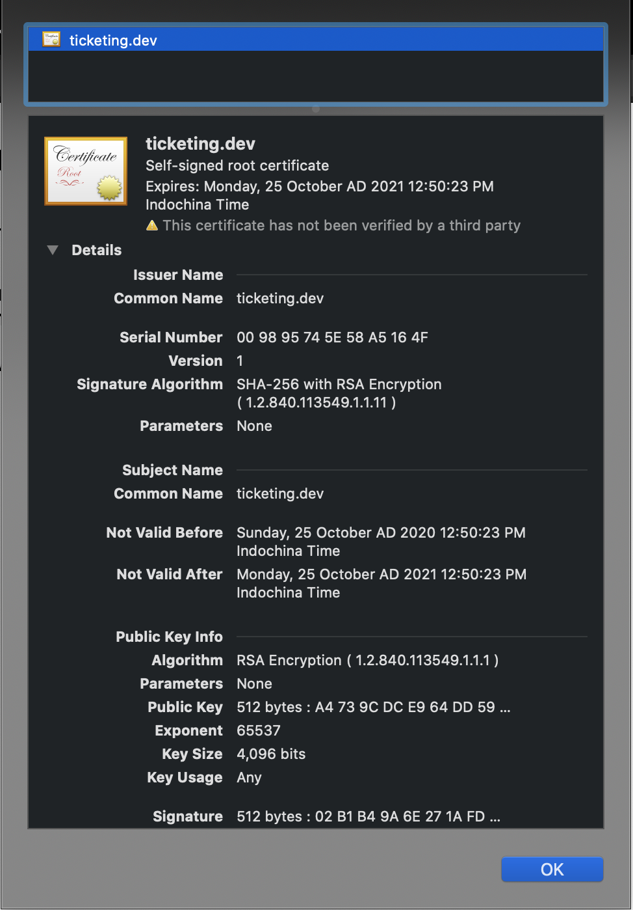

# Create a Kubernetes TLS Ingress from scratch

## Todos

- [x] Create Deployment

    ```shell
    k create depoly --image=nginx-depl
    ```
- [x] Create ingress
    ```yaml
    apiVersion: extensions/v1beta1
    kind: Ingress
    metadata:
      name: nginx
    spec:
      rules:
        - host: ticketing.dev
          http:
            paths:
              - backend:
                  serviceName: nginx-dpl
                  servicePort: 80
    ```

- [x] Generate certificate

    ```shell
    openssl req -x509 -newkey rsa:4096 -sha256 -nodes -keyout tls.key -out tls.crt -subj "/CN=ticketing.dev" -days 365
    ```

- [x] Create secret tls

    ```shell
    k create secret tls ticketing-dev-tls --cert=tls.crt --key=tls.key
    ```

- [x] Modify ingress.yaml

    ```yaml
    apiVersion: extensions/v1beta1
    kind: Ingress
    metadata:
      name: nginx
    spec:
      tls:
        - secretName: ticketing-dev-tls
          hosts:
            - ticketing.dev
      rules:
        - host: ticketing.dev
          http:
            paths:
              - backend:
                  serviceName: nginx-dpl
                  servicePort: 80
    ```

- [x] Apply deployment ingress.yaml
- [x] curl -k https://ticketing.dev
- [x] curl --cacert tls.crt https://ticketing.dev
- 
